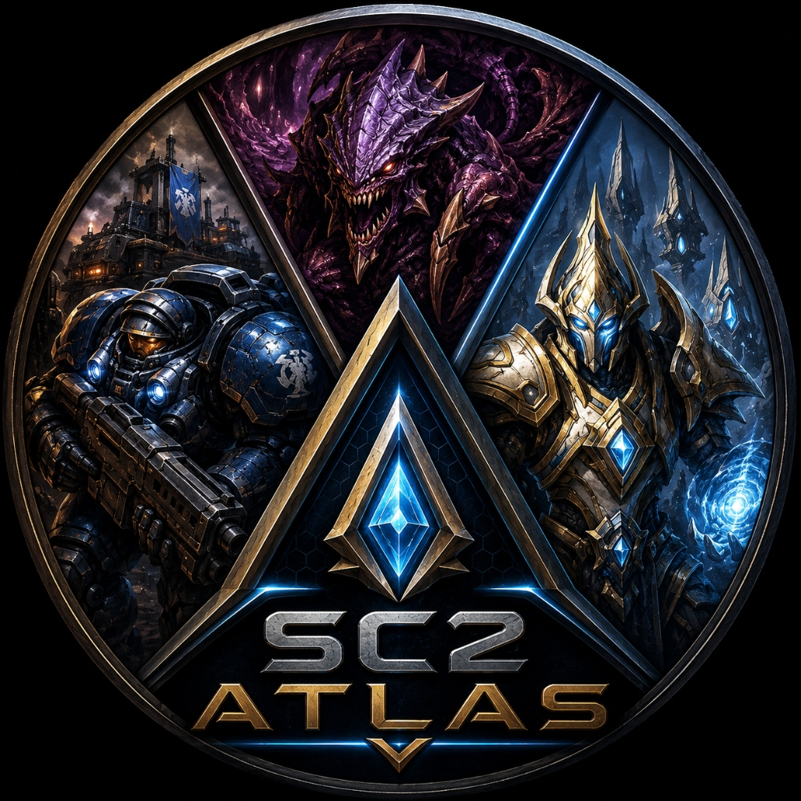

<p align="center">
  
</p>

# 🚀 SC2 Atlas Web


Un atlas interactivo y visual para **StarCraft II**, diseñado para explorar las unidades, estructuras y mecánicas del juego con renderizado 3D e interfaces dinámicas modernas.

Este proyecto tiene un propósito estrictamente **educativo, de aprendizaje técnico y de pasatiempo (hobbie)**, sirviendo como portafolio para demostrar la integración de tecnologías web de vanguardia.

---

## ⚖️ Descargo de Responsabilidad (Blizzard Legal Disclaimer)

Este es un proyecto no comercial creado por un seguidor para la comunidad de StarCraft II.

**StarCraft® II** y **Blizzard Entertainment®** son marcas comerciales o marcas registradas de **Blizzard Entertainment, Inc.**. Todas las imágenes, modelos 3D, nombres de unidades y contenido relacionado con el universo de StarCraft son propiedad intelectual y marca registrada de Blizzard Entertainment. 

Este proyecto se distribuye bajo las directrices de uso de contenido para la comunidad de Blizzard. No existe afiliación, patrocinio ni respaldo alguno por parte de Blizzard Entertainment hacia este sitio web.

---

## 🛠️ Tecnologías Principales

El proyecto está construido con un stack tecnológico moderno enfocado en alto rendimiento, interactividad y calidad visual:

*   **React 19** & **Next.js (App Router)**: Estructura del framework con renderizado en el servidor y optimización avanzada de rutas.
*   **Three.js**, **React Three Fiber (@react-three/fiber)** & **Drei (@react-three/drei)**: Renderizado 3D interactivo en tiempo real para visualizar elementos del juego.
*   **TailwindCSS v4**: Estilos premium utilizando el nuevo motor y compilador optimizado de Tailwind.
*   **Framer Motion**: Animaciones fluidas e interactivas en la interfaz de usuario.
*   **Next-intl**: Sistema completo de internacionalización (i18n) para soportar múltiples idiomas.
*   **TypeScript**: Tipado estático estricto para un desarrollo robusto y mantenible.

---

## 📂 Estructura del Proyecto

El código fuente está organizado siguiendo las mejores prácticas para proyectos Next.js:

```text
SC2-Atlas-Web/
├── public/                 # Recursos estáticos (imágenes, modelos 3D, iconos)
├── src/
│   ├── app/                # Enrutamiento de Next.js (App Router)
│   │   └── [locale]/       # Rutas localizadas dinámicamente (i18n)
│   │       ├── races/      # Páginas y vistas para las Razas (Terran, Zerg, Protoss)
│   │       └── units/      # Detalle interactivo de las unidades
│   ├── components/         # Componentes modulares y reutilizables de React
│   │   ├── analytics/      # Integraciones de telemetría y rendimiento
│   │   ├── layout/         # Componentes estructurales (Navbar, Footer, Sidebar)
│   │   ├── ui/             # Componentes de interfaz comunes (botones, modales, tarjetas)
│   │   └── units/          # Componentes específicos de unidades (visores 3D, estadísticas)
│   ├── context/            # Proveedores de estado global de React
│   ├── data/               # Archivos JSON y constantes de datos de StarCraft II
│   ├── i18n/               # Configuración y middleware de traducción
│   ├── lib/                # Funciones de utilidad, helpers y clientes de APIs
│   ├── messages/           # Diccionarios de traducción (ES, EN, etc.)
│   └── types/              # Definiciones de tipos globales y modelos de TypeScript
├── package.json            # Configuración de dependencias y scripts de npm
├── postcss.config.mjs      # Configuración del procesador CSS PostCSS
├── tsconfig.json           # Configuración del compilador TypeScript
└── vercel.json             # Ajustes de despliegue para la plataforma Vercel
```

---

## 🚀 Instalación y Desarrollo Local

### Requisitos Previos

*   **Node.js**: `>=22.12.0` (recomendado)
*   **npm**: `>=10.0.0`

### Variables de Entorno

El proyecto incluye soporte para **Google Analytics** y **control de indexación**. Para configurarlo localmente, crea un archivo `.env.local` en la raíz del proyecto y define las siguientes variables:

```env
# Google Analytics 4
NEXT_PUBLIC_GA_MEASUREMENT_ID=G-ECNTCPNV48
NEXT_PUBLIC_ANALYTICS_ENABLED=true

# Control de Indexación para Buscadores (robots.txt)
NEXT_PUBLIC_INDEXING_ENABLED=true
```

> [!NOTE]
> *   Si no se configura `NEXT_PUBLIC_GA_MEASUREMENT_ID` o `NEXT_PUBLIC_ANALYTICS_ENABLED` se establece en `false`, el rastreo de Google Analytics y la inyección de sus scripts asociados en el DOM se desactivarán por completo.
> *   Los usuarios pueden habilitar/deshabilitar la analítica de forma interactiva desde el banner de consentimiento de cookies o directamente desde el interruptor en la **Política de Privacidad**.
> *   `NEXT_PUBLIC_INDEXING_ENABLED` controla si los motores de búsqueda indexan el sitio web (`true` genera un robots.txt permitiendo indexación, `false` lo bloquea).

### Pasos para Empezar

1.  **Clona el repositorio:**
    ```bash
    git clone https://github.com/tu-usuario/SC2-Atlas-Web.git
    cd SC2-Atlas-Web
    ```

2.  **Instala las dependencias:**
    ```bash
    npm install
    ```

3.  **Inicia el servidor de desarrollo:**
    ```bash
    npm run dev
    ```

4.  **Abre el navegador:**
    Visita [http://localhost:3000](http://localhost:3000) para ver la aplicación en ejecución.

---

## 📦 Producción y Despliegue

Para compilar y optimizar la aplicación para producción:

```bash
npm run build
```

Una vez finalizada la compilación, puedes levantar el servidor de producción localmente con:

```bash
npm run start
```

El despliegue está preconfigurado para **Vercel** usando el archivo `vercel.json` incluido en el proyecto.

---

## 📊 Documentación de Eventos de Analítica

Este proyecto rastrea métricas de interacción de los usuarios de manera completamente segura y anónima para guiar la iteración y el perfeccionamiento de la herramienta.

### Reglas de Privacidad y Seguridad
*   **Sin Información Personal Identificable (PII)**: La aplicación no recopila, almacena ni transmite nombres, correos electrónicos, direcciones IP ni identificadores únicos de usuario.
*   **Búsquedas Anónimas**: Los términos de búsqueda ingresados en los filtros de texto son eliminados. Google Analytics solo recibe el número de caracteres (`query_length`) y el total de resultados encontrados (`results_count`).
*   **Navegación Anonimizada**: Las selecciones de facciones, clics en tarjetas de unidad y filtros personalizados se asocian puramente con propiedades de ID genéricas (ej. `zerg`, `stalker`, `name`, `ranged`).

### Referencia de Eventos de Analítica

#### 1. `race_selected`
Se dispara cuando un usuario selecciona una facción en el Centro de Mando de la página de inicio.
*   **Categoría**: `engagement`
*   **Etiqueta**: `raceId` (ej. `protoss`)
*   **Parámetros Personalizados**:
    *   `race`: `terran` | `zerg` | `protoss`

#### 2. `sort_changed`
Se dispara cuando un usuario cambia el orden de ordenamiento en la lista de una facción.
*   **Categoría**: `filter`
*   **Etiqueta**: `sortBy` (ej. `minerals`)
*   **Parámetros Personalizados**:
    *   `race`: ID de la facción correspondiente.
    *   `sort_by`: `name` | `minerals` | `gas` | `buildTime`

#### 3. `unit_card_clicked`
Se dispara al hacer clic en la tarjeta de una unidad para explorar su ficha táctica.
*   **Categoría**: `engagement`
*   **Etiqueta**: `unitSlug` (ej. `stalker`)
*   **Parámetros Personalizados**:
    *   `race`: Raza de la unidad.
    *   `unit`: Slug de la unidad.

#### 4. `unit_detail_opened`
Se dispara al abrirse el modal o ficha de detalle de una unidad.
*   **Categoría**: `engagement`
*   **Etiqueta**: `unitSlug` (ej. `stalker`)
*   **Parámetros Personalizados**:
    *   `race`: Raza de la unidad.
    *   `unit`: Slug de la unidad.

#### 5. `role_filter_used`
Se dispara al usar un chip de filtro de rol en la lista de unidades (ej. básico, aéreo, asedio).
*   **Categoría**: `filter`
*   **Etiqueta**: `selectedRole` (ej. `air`)
*   **Parámetros Personalizados**:
    *   `race`: ID de la facción.
    *   `role`: Rol seleccionado.

#### 6. `search_used`
Se dispara al realizar una búsqueda de unidad. Cuenta con un retraso (debounce) de 1.5 segundos para evitar spam a Google Analytics.
*   **Categoría**: `filter`
*   **Etiqueta**: *Ninguna*
*   **Parámetros Personalizados**:
    *   `race`: ID de la facción.
    *   `query_length`: Longitud del texto de búsqueda.
    *   `results_count`: Cantidad de unidades encontradas tras el filtro.

#### 7. `language_changed`
Se dispara al cambiar el idioma de localización del sitio.
*   **Categoría**: `preferences`
*   **Etiqueta**: `newLocale` (ej. `es`)
*   **Parámetros Personalizados**:
    *   `language`: `en` | `es` | `pt`

#### 8. `external_link_clicked`
Se dispara al hacer clic en enlaces externos (como el enlace de DataTech H&P en el pie de página).
*   **Categoría**: `engagement`
*   **Etiqueta**: `outboundLabel` (ej. `DataTech H&P`)
*   **Parámetros Personalizados**:
    *   `label`: Nombre del enlace cliqueado.
    *   `location`: Sección de la página (ej. `footer`).

#### 9. `toggle_3d_mode`
Se dispara cuando un usuario alterna entre la vista 3D interactiva y el holograma 2D en el visor de modelos.
*   **Categoría**: `preferences`
*   **Etiqueta**: `disabled` | `enabled`
*   **Parámetros Personalizados**:
    *   `source`: Origen del cambio (ej. `model_viewer` o `home`).
    *   `unit`: Nombre de la unidad (cuando se cambia desde la ficha).

#### 10. `cookie_consent_accepted`
Se dispara cuando un usuario acepta explícitamente el uso de cookies analíticas desde el banner de consentimiento o la política de privacidad.
*   **Categoría**: `privacy`
*   **Etiqueta**: `all_cookies`

#### 11. `cookie_consent_declined`
Se dispara cuando un usuario rechaza el uso de cookies analíticas, optando únicamente por las cookies esenciales.
*   **Categoría**: `privacy`
*   **Etiqueta**: `essential_only`
